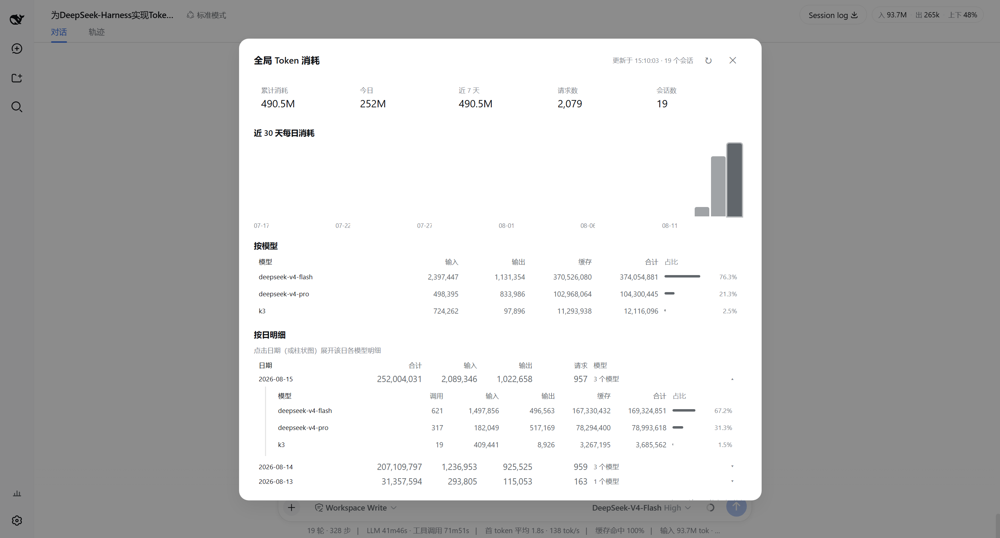
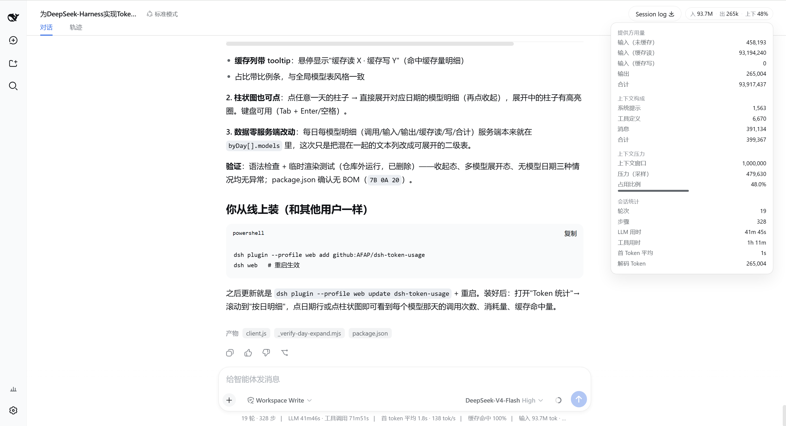

# dsh-token-usage

<div align="center">
  <a href="README.md">中文</a> · <b>English</b>
</div>

A token-usage display plugin for the [DeepSeek Harness](https://github.com/deepseek-ai/deepseek-harness) Web GUI.

It shows token consumption in `dsh web`, in two surfaces:

1. **Per-session pill**: on the right side of the session header — current session input/output tokens and context occupancy; click for the breakdown (provider usage, context composition, context pressure, session stats).
2. **Global consumption panel**: opened from the "Token stats" button at the bottom of the sidebar — daily totals with a last-30-days bar chart, **per-model breakdown** (input/output/cache/total/share), and a per-day drilldown table. Data comes from the session logs, aggregated on the fly; the panel auto-refreshes every 60s while open.

No configuration needed.

This plugin **does not modify any files**: the per-session pill only reads the session projections Harness pushes in real time; the global panel only **read-scans** the session logs under `$DSH_HOME\sessions` (no writes, no deletions, no changes to any log).

## Screenshots

| Global consumption panel (daily · per-model · per-day drilldown) | Session-header token pill |
|:---:|:---:|
|  |  |

## One-click install (GitHub)

```powershell
dsh plugin --profile web add github:AFAP/dsh-token-usage
```

Then **restart `dsh web`** to activate.

> After install the plugin lives at `$DSH_HOME\profiles\web\node_modules\dsh-token-usage` (pnpm clones it from GitHub), independent of the source repo location.
>
> Update: `dsh plugin --profile web update dsh-token-usage`
>
> Uninstall: `dsh plugin --profile web remove dsh-token-usage`

### Manual install from a source directory (equivalent, for verification)

```powershell
dsh plugin --profile web add "D:\path\to\dsh-token-usage"
```

### Verify it loaded

Open any session → the token pill appears in the header; the "Token stats" button appears at the bottom of the sidebar.

## Architecture & data flow

### Per-session pill (pure client)

The data path is entirely provided by built-in DeepSeek Harness components:

1. `@deepseek-ai/dsh-token-meter` (built into the base layer) folds each request's token usage into session projections: `tokenUsage`, `contextPressure`, `contextBreakdown`; `@deepseek-ai/dsh-session-stats` (built into the web layer) provides `sessionStats`.
2. `dsh-host-apiproxy` broadcasts **every projection change** as a `session/projection` frame; history tails also carry the projection baseline for reopened sessions.
3. The browser's `dsh-client-runtime` writes into `ProjectionValueStore`, exposed to UI components through the `useProjection(key)` hook of the slot standard kit.
4. The plugin registers `TokenUsageBadge` into `conversation.session.header.utilities`.

### Global panel (host-side log scan + client render)

```
dsh-token-usage (node half, lib/index.js — zero external deps, Node builtins + ./stats.js only)
  GET /api/token-stats ──▶ scans $DSH_HOME/sessions/**/session.jsonl.zstd
                            (concatenated zstd frames, decompressed frame by frame, JSONL events parsed)
                            ├─ assistant/message events → data.usage (provider-reported tokens)
                            ├─ request/header / request/context → current model
                            └─ aggregated by "local day × model" → JSON
                                  │
                                  ▼  (browser fetch, same-origin)
  GlobalStatsPanel (client half) ── summary cards + 30-day bar chart + per-model table + per-day drilldown
```

- Log format: `dsh-session-persistence-jsonl`'s **multi-frame zstd container** (one independent frame per appended batch); this plugin ports the official frame-boundary scanner (magic/descriptor/block/checksum), decompresses each frame with `zstdDecompressSync` (built into Node 22.22+), and skips torn trailing frames left by a crash.
- Per-request memoization by file mtime/size: only changed session logs are re-read, so refreshes are near-instant.
- `/api/token-stats` is registered as an **exact route** on the webserver (it wins over the connection plugin's `/api` prefix) and applies its own browser-trust fence (loopback / trustedHosts + same-origin checks, mirroring the `/api` fence in `dsh-client-connection`), rejecting DNS rebinding and cross-site requests.
- The host half is deliberately **dependency-free**: DSH_HOME is resolved from the environment (`$DSH_HOME` → `~/.dsh`) and no `@deepseek-ai/*` package is imported, so it loads correctly no matter how it is installed (git / registry / file: / link:).

## Directory layout

```
dsh-token-usage/               # repo root = npm package root
├── package.json               # dsh.bundle.patch (config patch layer) + dsh.client (browser declaration)
├── cordis.patch.yml           # composition row: inject webRuntime + trustedHosts config
├── LICENSE                    # MIT
├── screenshot/                # screenshots (panel.jpg global panel / pill.jpg session pill)
└── lib/
    ├── index.js               # host half: /api/token-stats route + zstd frame scan + aggregation cache
    ├── stats.js               # pure aggregation logic (no deps, independently testable)
    └── client.js              # browser bundle: per-session pill + global panel
```

## Usage

- **Per-session pill**: `in {input} · out {output} · ctx {occupancy%}` (compact 1.2k / 3.4M format); click for the four-section breakdown (provider usage / context composition / context pressure / session stats).
- **Global panel** (sidebar bottom → Token stats):
  - Summary cards: total / today / last 7 days / requests / sessions;
  - Last-30-days daily bar chart (today highlighted, hover shows values); **click a day's bar → expands that day's 24-hour usage below**;
  - By model (collapsed by default, click to expand): model | input | output | cache | total | share — the collapsed header shows the aggregate of all models;
  - Per-day drilldown: day | total | input | output | requests | model detail, click a day row to expand that day's models;
  - Auto-refreshes every 60s while open, manual refresh too; Esc / clicking the backdrop closes it.
- UI language follows the interface: Simplified Chinese / English dictionaries are both built in.

## License

MIT
